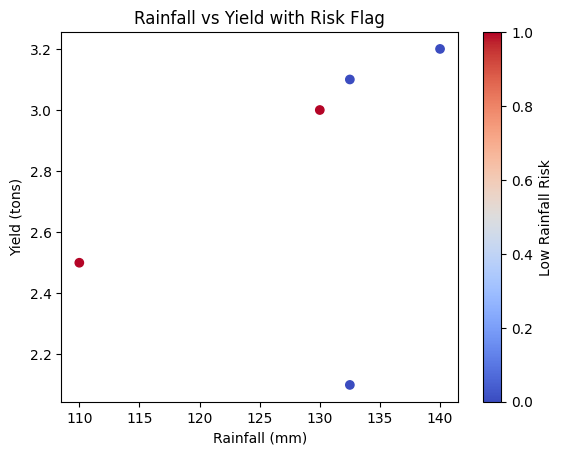
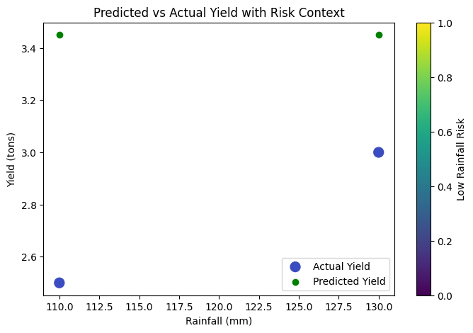

# Agri-predictive-analytics
Predictive data analytics projects focused on agriculture and AgriTech.

# Predictive Analysis of Rainfall Impact on Crop Yield (AgriTech)

## Overview
This project analyzes how rainfall influences crop yield using exploratory
data analysis and visualizations. The objective is to identify low-rainfall
risk periods and provide data-driven recommendations to support agricultural
planning and supply chain stability.

## Tools & Technologies
- Python
- pandas
- matplotlib
- Google Colab / Jupyter Notebook

## Key Insights
- Crop yields are higher during seasons with above-average rainfall
- Low-rainfall seasons are associated with increased yield risk
- Rainfall and crop yield show a positive correlation

## Prediction & Recommendation
If rainfall falls below the historical average, crop yields are expected to
decline. Farmers should implement drip irrigation strategies to mitigate
production risk and maintain stable agricultural output.

## Sample Visualization

## Model Performance

## Skills Demonstrated

- Data Cleaning & Preprocessing
- Missing Value Handling
- Feature Engineering
- Exploratory Data Analysis (EDA)
- Correlation Analysis
- Linear Regression Modeling
- Model Evaluation (MSE, R²)
- Data Visualization (Matplotlib, Seaborn)
- Python (Pandas, NumPy, Scikit-learn)

## References and Tools

### References
- **FAO (Food and Agriculture Organization)** – Historical crop yield and rainfall data. [FAO Website](http://www.fao.org)  
- **National Meteorological Sources** – Seasonal rainfall data used for analysis.  
- **Project Dataset** – Preprocessed and cleaned data used for this project: `datasets/agri_predictive_dataset_final.csv`  

### Tools and Libraries
- **Programming & Analysis:** Python 3, Pandas, NumPy  
- **Visualization:** Matplotlib, Seaborn  
- **Modeling:** Scikit-learn (Linear Regression)  
- **Environment:** Google Colab  

### Notes
- All data was preprocessed and anonymized for educational and predictive analytics purposes.  
- This repository contains **two main projects**:  
  1. **Week 1 Project:** Exploratory data analysis of agricultural data.  
  2. **Week 2–3 Project:** Data cleaning, feature engineering, predictive modeling, and visualization.  

These projects demonstrate a complete end-to-end workflow from raw data to actionable insights in AgriTech.

## Author
Anuoluwapo Emmanuel Oke. Aspiring Predictive Data Analyst (AgriTech focus)
